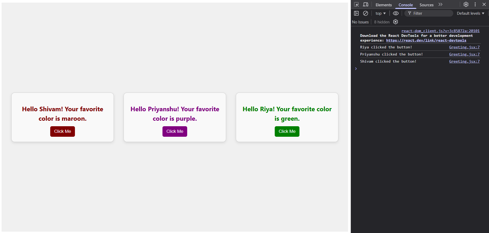

# Mini Greeting App

##  Assignment 2: Create a Mini Greeting App

###  Objective
Practice combining **JSX**, **Functional Components**, **Props**, **Styling**, and **Event Handling** in React by creating a simple greeting application.

---

##  Features
- Displays **3 greeting cards**, each showing:
  - A personalized message using the `name` prop.
  - The favorite color text styled using the `favoriteColor` prop.
- Each card includes a **button** that, when clicked, logs a message in the console:  
  `"Name clicked the button!"`
- Clean, card-style layout using **inline CSS** and **Flexbox**.

---

##  Technologies Used
- **React.js**
- **JavaScript (ES6)**
- **JSX**
- **Inline CSS**

---

 

